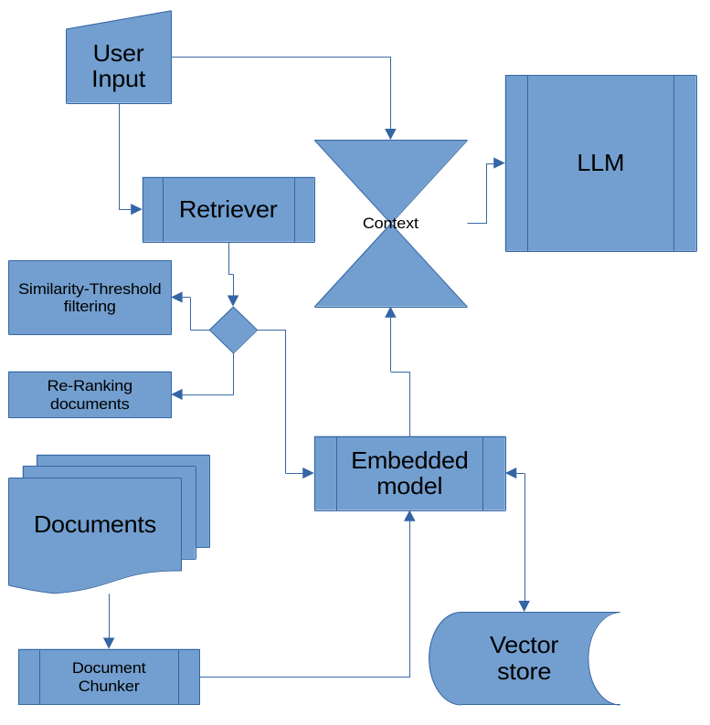

# T9RAG: Text Retrieval Augmented Generation System

> [!NOTE]
> This README.md has been (mostly) written by the LLM it self. That's why it is bragging!!



## Overview

T9RAG is a powerful and flexible Retrieval Augmented Generation (RAG) system designed to process, embed, and query documents using state-of-the-art language models and vector databases. It combines document processing, embedding generation, vector storage, and language model inference to provide accurate and context-aware responses to user queries.

## Updating

Updating to a new version

```
(.venv) git pull
(.venv) pip install --upgrade .
```

## Features

- Document processing from various file formats
- Embedding generation using Sentence Transformers
- Vector storage and retrieval using ChromaDB
- Language model inference using Ollama
- Customizable context window for LLM
- Customizable LLM temperature, max tokens and top_p
- Customizable vector database query results
- Chunked vectorization of documents
- Similarity-threshold filtering
- Re-ranking of documents with cross-encoder embedding
- Command-line interface for easy interaction

## Components

### 1. Document Reader (`document_reader.py`)

Handles loading and processing of documents from a specified directory. Supports various file formats.

### 2. Embedding Model (`embedding_model.py`)

Utilizes Sentence Transformers to generate embeddings for documents and queries.

### 3. Vector Store (`vector_store.py`)

Manages the storage and retrieval of document embeddings using ChromaDB.

### 4. Ollama LLM Interface (`ollama_llm.py`)

Provides an interface to initialize and interact with the Ollama language model.

-### 5. Main Application (`main.py`)

Orchestrates the entire RAG process and provides a command-line interface for user interaction.

## Usage

```bash
rag --help
Usage: rag [OPTIONS] COMMAND [ARGS]...

  General commands

Options:
  --help  Show this message and exit.

Commands:
  ask
  read-documents
  version         Show version
```

```bash
rag read-documents --help
Usage: rag read-documents [OPTIONS]
Options:
  --config FILE            Path to the configuration file.
  --directory TEXT         Directory containing the documents  [default:
                           ./documents]
  --model-name TEXT        Name of the HuggingFace model  [default:
                           NbAiLab/nb-bert-large]
  --db-directory TEXT      Directory where to store the vector database
                           [default: ./chroma_db]
  --chunk-size INTEGER     Size of document chunks  [default: 1024]
  --chunk-overlap INTEGER  Overlap between chunks  [default: 20]
  --help                   Show this message and exit

```

```bash
rag ask --help
Usage: rag ask [OPTIONS]

Options:
  --config FILE                 Path to the configuration file.
  --prompt TEXT                 The key to the prompt value stored in the configuration
                                file [default: default]
  --conversation                Enable conversation mode
  --model TEXT                  Name of the HuggingFace model  [default:
                                NbAiLab/nb-bert-large]
  --db-directory TEXT           Directory where the vector database is stored
                                [default: ./chroma_db]
  --llm-model TEXT              Name of the Ollama LLM model  [default: llama3.2]
  --llm-base-url TEXT           Base URL of the Ollama LLM  [default:
                                http://localhost:11434]
  --llm-timeout INTEGER         Timeout for the Ollama LLM  [default: 600]
  --context-window INTEGER      Context window size for Ollama LLM  [default:
                                3090]
  --verbose                     Enable verbose output
  --llm-max-tokens INTEGER      Maximum number of tokens for the Ollama LLM
                                [default: 1024]
  --llm-temperature FLOAT       Temperature for the Ollama LLM  [default: 0.3]
  --llm-top-p FLOAT             Top-p for the Ollama LLM  [default: 0.5]
  --n-results INTEGER           When querying the vector store, how many of
                                results to return  [default: 5]
  --num-gpu                     Number of GPUs to use for Ollama LLM
  --filter-similarities         Enable filtering similarities
  --similarity-threshold FLOAT  Similarity threshold for filtering results
                                [default: 0.5]
  --rerank-documents            Enable re-ranking documents
  --reranker-model TEXT         Name of the reranker model  [default: cross-
                                encoder/ms-marco-MiniLM-L-6-v2]
  --rerank-top-k INTEGER        Number of top-k results to rerank  [default:
                                10]
  --help                        Show this message and exit.
```

## Examples

### Reading Documents

```bash
rag read-documents --config prompts/default.yaml
```

### Asking questions

- invocation with defaults from configuration file

```bash
rag ask --config prompts/default.yaml --prompt concise
```

- invocation with defaults from configuration, file overriding **llm-timeout** on the command line

```bash
rag ask --config prompts/default.yaml --prompt default --llm-timeout 1200
```

- invocation without configuration file

```bash
rag ask --model intfloat/multilingual-e5-large-instruct \
--llm-model deepseek-r1:latest \
--llm-base-url http://localhost:11434 \
--verbose \
--query "something or other" \
--context-window 32000 \
--llm-top-p 0.1

```

This command allows you to ask questions based on the processed documents. It retrieves relevant context, generates a response using the LLM, and displays the answer.

It might be beneficial to use the same embedding model for **ask** as used when polulating the vector store with **read-documents**

### Installation

1. Clone the repository

```bash
git clone https://github.com/roderik333/t9rag.git
```

2. Create a virtual environment

```bash

cd t9rag
python -m venv .venv
source .venv/bin/activate
(.venv) python -m pip install .
(.venv) rag --help
```

## Discussion.

I've let Claude 3.5 explain the **chunking**, **filtering** and **reranking** implementation.

### Implemented methods

1. Chunking (done during document processing):
   Breaks documents into smaller, manageable pieces.
   Allows for more granular retrieval.
2. Filtering (done after initial retrieval):
   Applies a similarity threshold to remove less relevant chunks.
   Uses the filter_results function with semantic similarity.
3. Re-ranking (done after filtering):
   Applies a more sophisticated model to score and reorder the filtered results.
   Uses the Reranker class with a cross-encoder model.

### Here's how this combination influences the results:

#### Pros:

1. Highly Refined Results: The three-step process provides multiple layers of relevance checking, potentially leading to very high-quality final results.
2. Efficiency: Filtering reduces the number of chunks that need to be re-ranked, which can save computational resources.
3. Flexibility: You can adjust the filtering threshold and re-ranking parameters independently, allowing for fine-tuned control over the retrieval process.
4. Noise Reduction: Filtering helps eliminate clearly irrelevant chunks before the more expensive re-ranking step, reducing noise in the final output.

#### Cons:

1. Risk of Over-filtering: If the similarity threshold in the filtering step is set too high, you might eliminate relevant chunks before they even reach the re-ranking stage.
2. Potential Redundancy: There's some overlap in what filtering and re-ranking are trying to achieve (improving relevance). This could lead to diminishing returns or even conflicting results in some cases.
3. Increased Complexity: Adding filtering between retrieval and re-ranking increases the overall complexity of the system, making it harder to debug and optimize.
4. Parameter Tuning Challenges: With three stages affecting the final results, finding the optimal parameters for chunk size, filter threshold, and re-ranking becomes more challenging.
5. Potential for Bias Amplification: If there are any biases in the initial retrieval or filtering steps, re-ranking might amplify these biases rather than correct them. To make the most of this setup:

#### Strategy

1. Carefully tune the similarity threshold in the filtering step. It should be low enough to allow potentially relevant chunks through, but high enough to meaningfully reduce the workload for the re-ranker.
2. Monitor the number of chunks that make it through the filtering step. If it's often very low or zero, you might need to lower the threshold.
3. Consider logging or analyzing the results at each stage (after retrieval, after filtering, after re-ranking) to understand how each step is affecting the results.
4. Experiment with the order of operations. For example, you could try re-ranking first and then filtering, which might produce different results.
5. Be mindful of query-dependent behavior. Some queries might benefit more from filtering, while others might benefit more from re-ranking. You could potentially implement adaptive strategies based on query characteristics.
6. Regularly evaluate the end-to-end performance of your system, not just the individual components. The interaction between these components can sometimes lead to unexpected results.

[Rerank examples](https://www.sbert.net/examples/sentence_transformer/applications/retrieve_rerank/README.html)

[Rerank models](https://www.sbert.net/docs/cross_encoder/pretrained_models.html#ms-marco)
