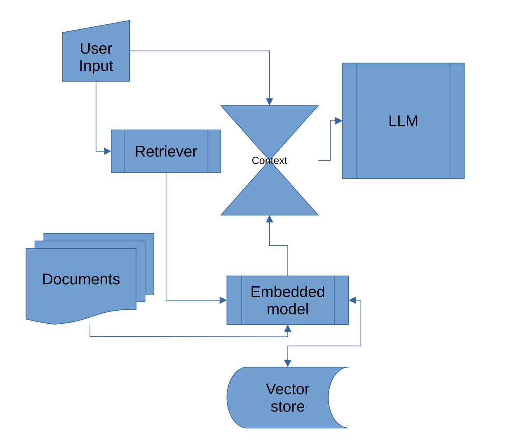

# T9RAG: Text Retrieval Augmented Generation System

> [!NOTE]
> This README.md has been (mostly) written by the LLM it self. That's why it is bragging!!
> 

## Overview

T9RAG is a powerful and flexible Retrieval Augmented Generation (RAG) system designed to process, embed, and query documents using state-of-the-art language models and vector databases. It combines document processing, embedding generation, vector storage, and language model inference to provide accurate and context-aware responses to user queries.

## Updating

Updating to a new version

```
(.venv) git pull
(.venv) pip install --upgrade .
```

## Features

- Document processing from various file formats
- Embedding generation using Sentence Transformers
- Vector storage and retrieval using ChromaDB
- Language model inference using Ollama
- Customizable context window for LLM
- Customizable LLM temperature, max tokens and top_p
- Customizable vector database query results
- Command-line interface for easy interaction

## Components

### 1. Document Reader (`document_reader.py`)

Handles loading and processing of documents from a specified directory. Supports various file formats.

### 2. Embedding Model (`embedding_model.py`)

Utilizes Sentence Transformers to generate embeddings for documents and queries.

### 3. Vector Store (`vector_store.py`)

Manages the storage and retrieval of document embeddings using ChromaDB.

### 4. Ollama LLM Interface (`ollama_llm.py`)

Provides an interface to initialize and interact with the Ollama language model.

### 5. Main Application (`main.py`)

Orchestrates the entire RAG process and provides a command-line interface for user interaction.

## Usage

```bash
rag --help
Usage: rag [OPTIONS] COMMAND [ARGS]...

  General commands

Options:
  --help  Show this message and exit.

Commands:
  ask
  read-documents
  version         Show version
```

```bash
rag read-documents --help
Usage: rag read-documents [OPTIONS]

Options:
  --directory TEXT     Directory containing the documents  [default:
                       ./documents]
  --model-name TEXT    Name of the HuggingFace model  [default: NbAiLab/nb-
                       bert-large]
  --db-directory TEXT  Directory where to store the vector database  [default:
                       ./chroma_db]
  --help               Show this message and exit.
```

```bash
rag ask --help
Usage: rag ask [OPTIONS]

Options:
  --prompt TEXT             The key to the prompt value stored in prompts.json
                            [default: default]
  --query TEXT              The question to ask the RAG system
  --model TEXT              Name of the HuggingFace model  [default:
                            NbAiLab/nb-bert-large]
  --db-directory TEXT       Directory where the vector database is stored
                            [default: ./chroma_db]
  --llm-model TEXT          Name of the Ollama LLM model  [default: llama3.2]
  --llm-base-url TEXT       Base URL of the Ollama LLM  [default:
                            http://localhost:11434]
  --llm-timeout INTEGER     Timeout for the Ollama LLM  [default: 600]
  --context-window INTEGER  Context window size for Ollama LLM  [default:
                            3090]
  --verbose                 Enable verbose output
  --llm-max-tokens INTEGER  Maximum number of tokens for the Ollama LLM
                            [default: 1024]
  --llm-temperature FLOAT   Temperature for the Ollama LLM  [default: 0.3]
  --llm-top-p FLOAT         Top-p for the Ollama LLM  [default: 0.5]
  --n-results INTEGER       When querying the vector store, how many of
                            results to return  [default: 5]
  --help                    Show this message and exit.
```

## Examples

### Reading Documents

```bash
rag read-documents --model-name intfloat/multilingual-e5-large-instruct
```

### Asking questions

```bash
rag ask --model intfloat/multilingual-e5-large-instruct \
--llm-model deepseek-r1:latest \
--llm-base-url http://localhost:11434 \
--verbose \
--query "something or other" \
--context-window 32000 \
--llm-top-p 0.1

```

This command allows you to ask questions based on the processed documents. It retrieves relevant context, generates a response using the LLM, and displays the answer.

It might be beneficial to use the same embedding model for **ask** as used when polulating the vector store with **read-documents**

### Installation

1. Clone the repository

```bash
git clone https://github.com/roderik333/t9rag.git
```

2. Create a virtual environment

```bash

cd t9rag
python -m venv .venv
source .venv/bin/activate
(.venv) python -m pip install .
(.venv) rag --help
```
